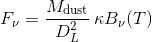
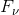
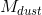
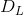
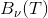
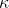
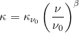
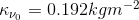

# Deriving the properties of interstellar dust from far-infrared spectral energy distributions
To infer properties of the interstellar dust contained within a galaxy, a modified black body spectrum can be fitted to 
the observed far-infrared (FIR) spectral energy distribution (SED) using a Markov Chain Monte Carlo bayesian sampling 
method with dust temperature, emissivity and dust mass as free parameters.

## Model
A modified black body (also called a 'gray body') has a spectrum given by:

where  is the flux density at the frequency  in the emitted 
frame,  the mass of dust,  the luminous distance of the 
source and  is the Planck function.  is the emissivity 
cross section per unit dust mass at the frequency 

where we have used . The index β is the emissivity parameter and thought to vary
between galaxies in the range 1 < β < 2 (where β = 1 would be a pure black body), however values outside of this range
have been observed. [1]
 
For the MCMC implementation we use [PyMC3](https://docs.pymc.io/), modelling each flux measurement as a normal
distribution with the mean given by the MBB function and the standard deviation as the error on the measurement.

## Data Sets
We use 5 sets of galaxies. I have included the data formatted since since the formatting and data cleaning was 
non-trivial and onerous.

- ### Great Observatories All-Sky Survey (GOALS)
GOALS is a comprehensive imaging and spectroscopic survey of over 200 local galaxies (i.e. with a redshift z < 0.088), a
complete subset of the *IRAS* Revised Bright Galaxy Sample which comprises of 629 objects with 60μm fluxes > 5.64Jy [2].
Of these sources, 199 are categorised as Luminous Infrared Galaxies (LIRGs) with
 > 11 and 20 as Ultra-Luminous Infrared Galaxies (ULIRGs) with 
 > 12.

- ### *Planck* Catalogue of Compact Sources (PCCS)
We include 17 sources from the *Planck* Catalogue of Compact Sources (PCCS) selected at 857GHz with a 90% completeness
level and minimum flux of 0.658Jy [3]. For these sources we were provided with SPIRE 250, 350 and 500 μm measurements,
for which we acquired *IRAS* 60 and 100 μm measurements from the NASA/IPAC Extragalactic Database (NED).

- ### *HERschel* ULIRG Survey (HERUS)
This set contains 43 *IRAS* local (z < 0.3) 60μm selected local ULIRGs from the Herschel ULIRG survey [4]. For these
sources we used the SPIRE flux measurements at 250, 350 and 500μm and *IRAS* 60 and 100μm measurements again retrieved
from NED.

- ### *Herschel* ATLAS (H-ATLAS)
By far the largest catalogue included is that of several hundred thousand sources taken from the *Herschel*
Astrophysical Terahertz Large Area Survey (H-ATLAS) [5], a survey over 600 deg² of the sky in five photometric bands -
100, 160μm (from PACS), 250, 350 and 500μm (from SPIRE).

- ### PACS (Cortese)
323 galaxies from the Herschel Reference Survey (HRS) in Cortese 2014 [6]. The HRS is a volume limited (15Mpc ≤ D ≤ 
25Mpc) K-band selected sample. These sources and Cortese's results are used to validate our method.

## Usage
First, try running `notebooks/model_convergence` to check that the model runs on your machine. All results were produced
with the package versions in `requirements.txt` on python 3.7 and with the default parameters set in `mcmc.create_args`.
To fit the model to the full dataset, run `python mcmc.py` (see `mcmc.create_args` for command line options for changing
the model parameters).

## Notebooks
TODO

## References
[1] [Dupac, X., Bernard, J.P., Boudet, N., Giard, M., Lamarre, J.M., Mény, C., Pajot, F., Ristorcelli, I., Serra, G., 
Stepnik, B. and Torre, J.P., 2003. Inverse temperature dependence of the dust submillimeter spectral index. Astronomy &
Astrophysics, 404(1), pp.L11-L15.](https://www.aanda.org/articles/aa/pdf/2003/22/aafc183.pdf)

[2] [Armus, L., Mazzarella, J.M., Evans, A.S., Surace, J.A., Sanders, D.B., Iwasawa, K., Frayer, D.T., Howell, J.H.,
Chan, B., Petric, A. and Vavilkin, T., 2009. GOALS: The Great Observatories All-Sky LIRG Survey. Publications of the
Astronomical Society of the Pacific, 121(880), p.559.](https://arxiv.org/pdf/0904.4498.pdf)

[3] [Ade, P.A., Aghanim, N., Argüeso, F., Armitage-Caplan, C., Arnaud, M., Ashdown, M., Atrio-Barandela, F., Aumont, J.,
Baccigalupi, C., Banday, A.J. and Barreiro, R.B., 2014. Planck 2013 results. XXVIII. The Planck catalogue of compact
sources. Astronomy & Astrophysics, 571, p.A28.
](https://www.aanda.org/articles/aa/pdf/2014/11/aa21524-13.pdf)

[4] [Clements, D.L., Pearson, C., Farrah, D., Greenslade, J., Bernard-Salas, J., González-Alfonso, E., Afonso, J.,
Efstathiou, A., Rigopoulou, D., Lebouteiller, V. and Hurley, P.D., 2017. HERUS: the far-IR/submm spectral energy
distributions of local ULIRGs and photometric atlas. Monthly Notices of the Royal Astronomical Society, 475(2),
pp.2097-2121.](https://arxiv.org/pdf/1712.04843)

[5] [Valiante, E., Smith, M.W.L., Eales, S., Maddox, S.J., Ibar, E., Hopwood, R., Dunne, L., Cigan, P.J., Dye, S.,
Pascale, E. and Rigby, E.E., 2016. The Herschel-ATLAS data release 1–I. Maps, catalogues and number counts. Monthly
Notices of the Royal Astronomical Society, 462(3), pp.3146-3179.](https://arxiv.org/pdf/1606.09615)

[6] [Cortese, L., Fritz, J., Bianchi, S., Boselli, A., Ciesla, L., Bendo, G.J., Boquien, M., Roussel, H., Baes, M., 
Buat, V. and Clemens, M., 2014. PACS photometry of the Herschel Reference Survey–far-infrared/submillimetre colours as
tracers of dust properties in nearby galaxies. Monthly Notices of the Royal Astronomical Society, 440(1),
pp.942-956.](https://academic.oup.com/mnras/article/440/1/942/2891848)

## Acknowledgement
This work has made use of the NASA/IPAC Extragalactic Database [(NED)](https://ned.ipac.caltech.edu/) which is operated
by the Jet Propulsion Laboratory, California Institute of Technology, under contract with the National Aeronautics and
Space Administration.